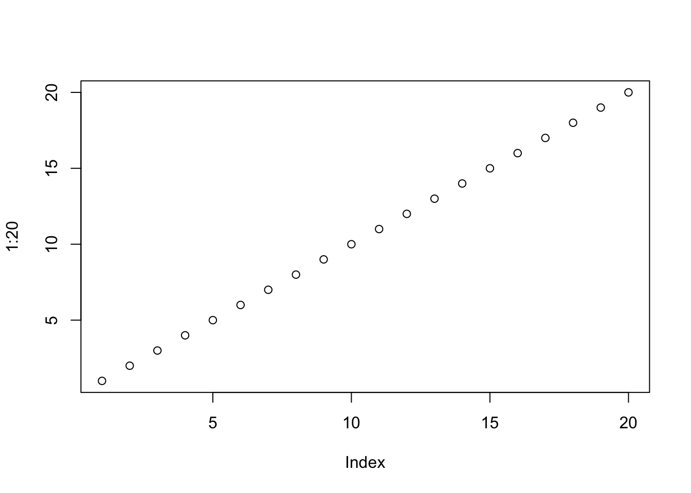
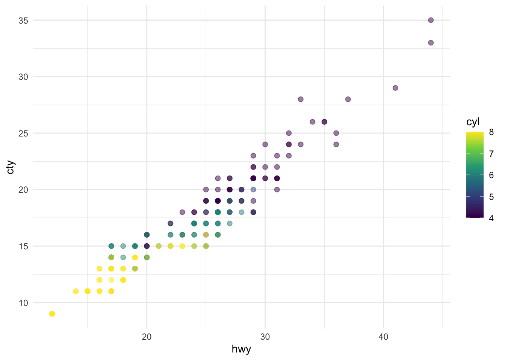

::: {.cell}

:::


## Three articles with data & visualizations


# Our World is Data
1. https://ourworldindata.org/data-insights#second-most-recent-data-insight

In this article is explains that data insights is a regularly-updated collection of visualizations that give us current world new data. The visuals from this website are very clean . In the article about China's fertilizer consumption I like how it was very simple to see where fertalizer use peaked, the use of arrows and captions make the graphs easier to read and also to only label important dates and numbers. 


# Pricenomics
2. https://priceonomics.com/how-has-cryptocurrency-mining-influenced-gpu-prices/

For this article I see a visual named "GeFore RTX eBay Sold Prices Over Time" and it is a pretty bad graph to look at. There is simply too much going on in this graph. I see a scatter plot, a trend line, a time series line graph and a following line along the average plotted points. The graph below with all the lines could probably be designed better, what I see is that all prices have recently dropped, but besides that it is very difficult to compare percentage change or to compare the lines that are all bunched together. 


# The Pudding
3. https://pudding.cool/2025/04/birthday-effect/

I love how in the beginning of the article there is a visual that explains the article and explains how the data is represented. This visual also looks like it is custom made and is unique. Some graphs are very simple but tell a story with pointing out a key finding. Then after the visual there is text to explain what is being visualized in the article. Half way through we see a histrogram graph. Overall, I am very impressed how easy I can see their points and understand the data, along with the different types of graphs makes the article much more initutitve. 

The visualization below shows a positive, strong, and linear relationship between the city and highway mileage of these cars.
Additionally, mileage is higher for cars with fewer cylinders.


::: {.cell}

```{.r .cell-code}
plot(1:20)
```

::: {.cell-output-display}
{width=672}
:::
:::


::: {.cell}

```{.r .cell-code}
ggplot(mpg, aes(x = hwy, y = cty, color = cyl)) +
  geom_point(alpha = 0.5, size = 2) +
  scale_color_viridis_c() +
  theme_minimal()
```

::: {.cell-output-display}
{width=672}
:::
:::


