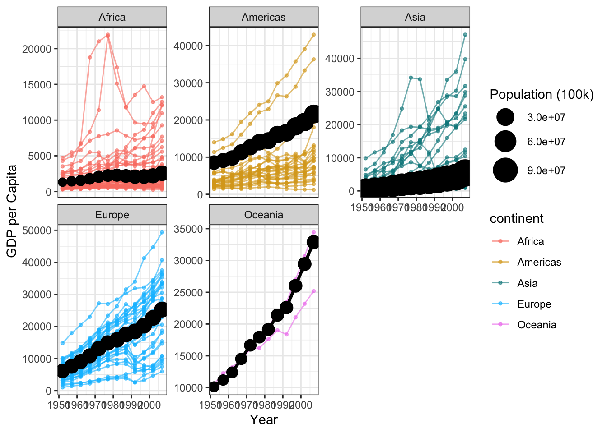

::: {.cell}

```{.r .cell-code}
library(tidyverse)
library(gapminder)
```
:::


::: {.cell}

```{.r .cell-code}
gap_clean <- gapminder %>%
filter(country != "Kuwait")
gap_weighted <- gap_clean %>%
group_by(continent, year) %>%
summarise(
weighted_gdp = weighted.mean(gdpPercap, pop),
weighted_pop = weighted.mean(pop)
)
ggplot() +

# Individual country lines

geom_line(
data = gap_clean,
aes(x = year, y = gdpPercap, group = country, color = continent),
alpha = 0.6
) +
geom_point(
data = gap_clean,
aes(x = year, y = gdpPercap, group = country, color = continent),
alpha = 0.6,
size = 1
) +

# Weighted average lines (black)

geom_line(
data = gap_weighted,
aes(x = year, y = weighted_gdp),
color = "black",
size = 1.2
) +

# Weighted average points (black)

geom_point(
data = gap_weighted,
aes(x = year, y = weighted_gdp, size = weighted_pop),
color = "black"
) +

scale_color_manual(values = c(
"Africa"   = "salmon",
"Americas" = "goldenrod",
"Asia"     = "turquoise4",
"Europe"   = "deepskyblue",
"Oceania"  = "violet"
)) +

scale_size_continuous(range = c(3, 10), name = "Population (100k)") +

facet_wrap(~ continent, scales = "free_y") +
theme_bw() +
labs(
x = "Year",
y = "GDP per Capita"
)
```

::: {.cell-output-display}
{width=672}
:::
:::

