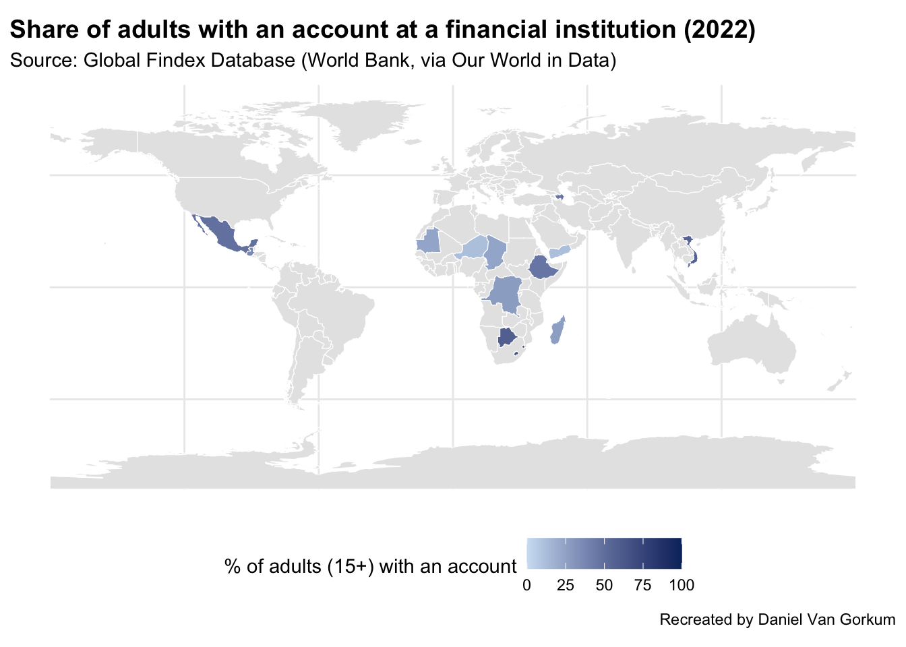

## Introduction

Here is the original chart that I am trying to recreate:


<https://ourworldindata.org/economic-growth>

This visual shows for each country and gives you a bar on the bottom to filter to what year and then saturates each country to the percentage of people that have an account with financial institutions.


::: {.cell}

```{.r .cell-code}
library(tidyverse)
library(rnaturalearth)
library(sf)
library(readr)

# Load dataset directly from Our World in Data
url <- "https://ourworldindata.org/grapher/account-at-financial-institution.csv"
accounts <- read_csv(url)
```
:::


::: {.cell}

```{.r .cell-code}
# Prepare 2022 data and rename
accounts_2022 <- accounts %>%
  filter(Year == 2022) %>%
  rename(
    country = Entity,
    iso_a3 = Code,
    share = `Account ownership at a financial institution or with a mobile-money-service provider (% of population ages 15+)`
  )
```
:::


::: {.cell}

```{.r .cell-code}
# Fix country names to match rnaturalearth
accounts_2022 <- accounts_2022 %>%
  mutate(country = case_when(
    country == "United States" ~ "United States of America",
    country == "Czechia" ~ "Czech Republic",
    country == "Democratic Republic of Congo" ~ "Dem. Rep. Congo",
    country == "Republic of Congo" ~ "Congo",
    country == "Eswatini" ~ "Swaziland",
    country == "North Macedonia" ~ "Macedonia",
    country == "Timor" ~ "East Timor",
    TRUE ~ country
  ))
# Get world map data
world <- ne_countries(scale = "medium", returnclass = "sf")

# Join datasets using country names
world_data <- world %>%
  left_join(accounts_2022, by = c("name" = "country"))

# Get world map data
world <- ne_countries(scale = "medium", returnclass = "sf")

# Join datasets
world_data <- left_join(world, accounts_2022, by = c("iso_a3"))
# Optional: check which countries didn't match
anti_join(accounts_2022, world, by = c("country" = "name"))
```

::: {.cell-output .cell-output-stdout}

```
# A tibble: 1 × 4
  country   iso_a3  Year share
  <chr>     <chr>  <dbl> <dbl>
1 Swaziland SWZ     2022  66.2
```


:::

```{.r .cell-code}
# Plot
ggplot(world_data) +
  geom_sf(aes(fill = share), color = "white", size = 0.1) +
  scale_fill_gradient(
    name = "% of adults (15+) with an account",
    low = "#cfe2f3", high = "#08306b", na.value = "grey90",
    limits = c(0, 100)
  ) +
  labs(
    title = "Share of adults with an account at a financial institution (2022)",
    subtitle = "Source: Global Findex Database (World Bank, via Our World in Data)",
    caption = "Recreated by Daniel Van Gorkum"
  ) +
  theme_minimal() +
  theme(
    plot.title = element_text(face = "bold", size = 14),
    legend.position = "bottom"
  )
```

::: {.cell-output-display}
{width=672}
:::
:::

