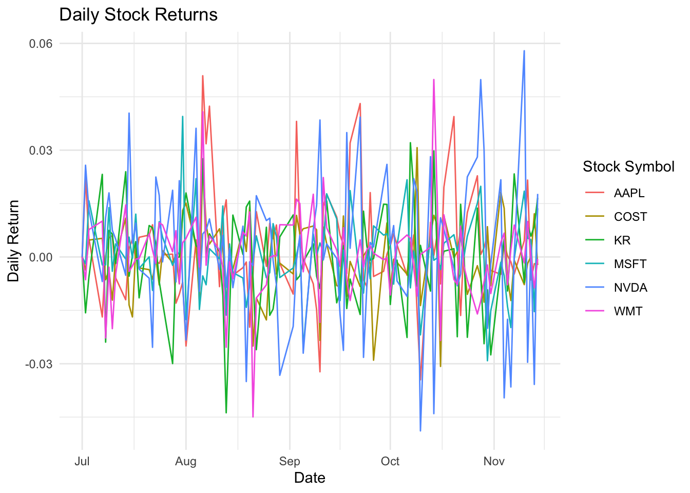
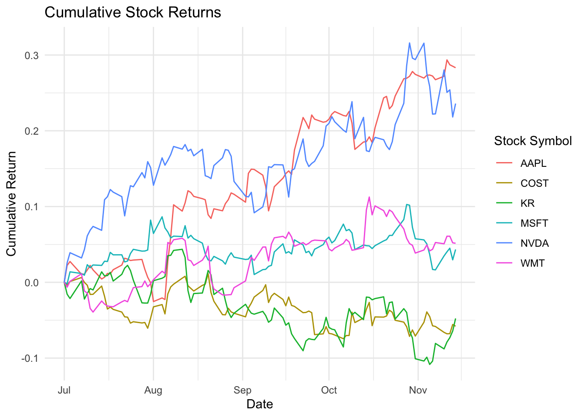

## Get Ready


::: {.cell}

```{.r .cell-code}
library(tidyquant)
library(dplyr)
library(ggplot2)

stocks <- tq_get(c("NVDA", "AAPL", "WMT", "KR", "MSFT", "COST"),
                 from = "2025-07-01", to = Sys.Date())

stocks <- stocks %>%
  group_by(symbol) %>%
  tq_transmute(select = adjusted,
               mutate_fun = periodReturn,
               period = 'daily',
               col_rename = 'daily_return')
```
:::


::: {.cell}

```{.r .cell-code}
ggplot(stocks, aes(x = date, y = daily_return, color = symbol)) +
  geom_line() +
  labs(title = "Daily Stock Returns",
       x = "Date",
       y = "Daily Return",
       color = "Stock Symbol") +
  theme_minimal()
```

::: {.cell-output-display}
{width=672}
:::
:::


::: {.cell}

```{.r .cell-code}
stocks %>%
  group_by(symbol) %>%
  summarise(total_return = sum(daily_return, na.rm = TRUE)) %>%
  arrange(desc(total_return)) %>%
  head(1)
```

::: {.cell-output .cell-output-stdout}

```
# A tibble: 1 × 2
  symbol total_return
  <chr>         <dbl>
1 AAPL          0.283
```


:::
:::


::: {.cell}

```{.r .cell-code}
stocks_cumulative <- stocks %>%
  group_by(symbol) %>%
  mutate(cumulative_return = cumsum(daily_return))

ggplot(stocks_cumulative, aes(x = date, y = cumulative_return, color = symbol)) +
  geom_line() +
  labs(title = "Cumulative Stock Returns",
       x = "Date",
       y = "Cumulative Return",
       color = "Stock Symbol") +
  theme_minimal()
```

::: {.cell-output-display}
{width=672}
:::
:::


I chose daily stock returns as one of my graphs to show what stock have the highest volatility. You can see that some great stocks like Apple and Nvidia tend to fluctuate very heavily on a daily level. This is important to consider so that you choose these stocks for a more long-term hold instead of day trading that can provide much risk. Then I chose cumulative to show the return over time which highlights Apple and Nvidida as the highest cumulative return for this year out of the 6 equities.
