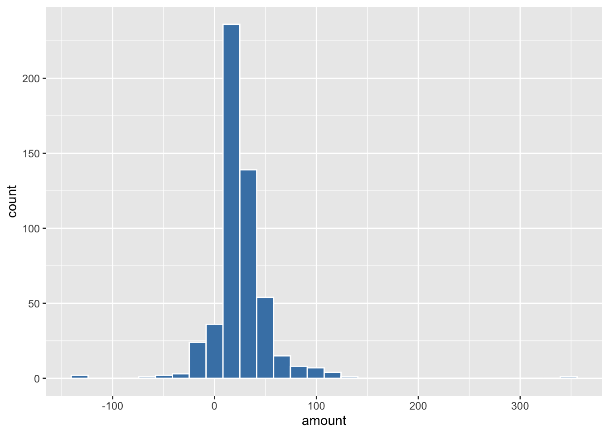
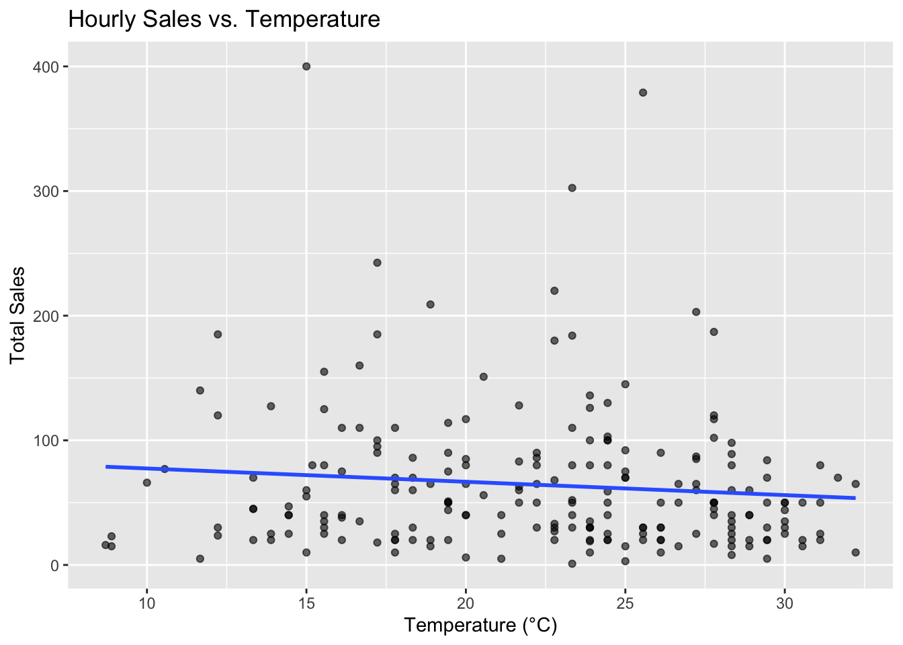
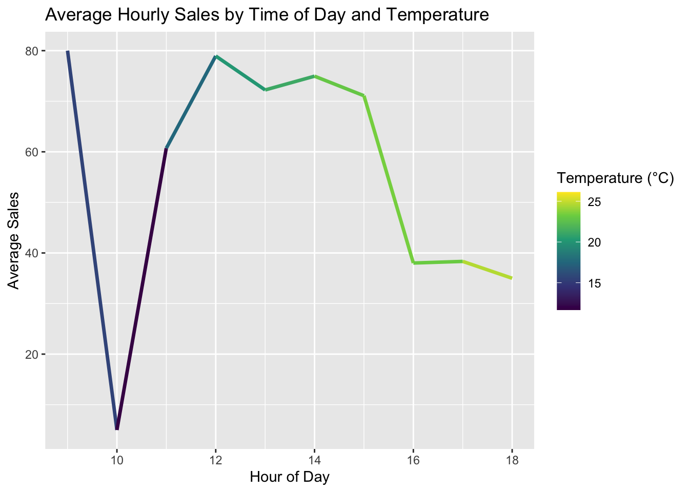

## Set Up


::: {.cell}

```{.r .cell-code}
# Load libraries
library(tidyverse)
library(lubridate)
library(riem)


carwash <- read_csv("https://byuistats.github.io/M335/data/carwash.csv")
glimpse(carwash)
```

::: {.cell-output .cell-output-stdout}

```
Rows: 533
Columns: 4
$ name   <chr> "SplashandDash", "SplashandDash", "SplashandDash", "SplashandDa…
$ type   <chr> "Services", "Services", "Services", "Services", "Services", "Se…
$ time   <dttm> 2016-05-13 20:27:00, 2016-05-13 20:27:00, 2016-05-16 19:31:00,…
$ amount <dbl> 1.00, 0.00, 23.58, 18.87, 23.58, 23.58, 18.87, 14.15, 47.17, 47…
```


:::
:::


::: {.cell}

```{.r .cell-code}
carwash <- carwash %>%
  mutate(local_time = with_tz(time, tzone = "America/Boise"))


summary(carwash)
```

::: {.cell-output .cell-output-stdout}

```
     name               type                time                    
 Length:533         Length:533         Min.   :2016-05-13 20:27:00  
 Class :character   Class :character   1st Qu.:2016-05-31 15:56:00  
 Mode  :character   Mode  :character   Median :2016-06-15 20:16:00  
                                       Mean   :2016-06-15 14:19:11  
                                       3rd Qu.:2016-06-30 22:18:00  
                                       Max.   :2016-07-18 16:58:00  
     amount          local_time                 
 Min.   :-130.00   Min.   :2016-05-13 14:27:00  
 1st Qu.:  15.00   1st Qu.:2016-05-31 09:56:00  
 Median :  20.00   Median :2016-06-15 14:16:00  
 Mean   :  25.19   Mean   :2016-06-15 08:19:11  
 3rd Qu.:  30.00   3rd Qu.:2016-06-30 16:18:00  
 Max.   : 350.00   Max.   :2016-07-18 10:58:00  
```


:::

```{.r .cell-code}
carwash %>%
ggplot(aes(x = amount)) +
geom_histogram(bins = 30, fill = "steelblue", color = "white")
```

::: {.cell-output-display}
{width=672}
:::
:::


::: {.cell}

```{.r .cell-code}
carwash <- carwash %>%
filter(amount > 0) %>%
mutate(hour = ceiling_date(local_time, unit = "hour"))

hourly_sales <- carwash %>%
group_by(hour) %>%
summarise(total_sales = sum(amount, na.rm = TRUE))

range(hourly_sales$hour)
```

::: {.cell-output .cell-output-stdout}

```
[1] "2016-05-13 15:00:00 MDT" "2016-07-15 17:00:00 MDT"
```


:::

```{.r .cell-code}
weather <- riem_measures(
station = "RXE",
date_start = as_date(min(hourly_sales$hour)),
date_end = as_date(max(hourly_sales$hour))
)

weather <- weather %>%
mutate(hour = ceiling_date(valid, unit = "hour")) %>%
group_by(hour) %>%
summarise(temp_f = mean(tmpf, na.rm = TRUE)) %>%
mutate(temp_c = (temp_f - 32) * 5/9)

combined <- left_join(hourly_sales, weather, by = "hour")
```
:::


::: {.cell}

```{.r .cell-code}
ggplot(combined, aes(x = temp_c, y = total_sales)) +
  geom_point(alpha = 0.6) +
  geom_smooth(method = "lm", se = FALSE) +
  labs(title = "Hourly Sales vs. Temperature",
       x = "Temperature (°C)",
       y = "Total Sales")
```

::: {.cell-output-display}
{width=672}
:::

```{.r .cell-code}
combined %>%
  mutate(hour_of_day = hour(hour)) %>%
  group_by(hour_of_day) %>%
  summarise(avg_sales = mean(total_sales, na.rm = TRUE),
            avg_temp = mean(temp_c, na.rm = TRUE)) %>%
  ggplot(aes(x = hour_of_day, y = avg_sales, color = avg_temp)) +
  geom_line(size = 1.2) +
  scale_color_viridis_c() +
  labs(title = "Average Hourly Sales by Time of Day and Temperature",
       x = "Hour of Day", y = "Average Sales", color = "Temperature (°C)")
```

::: {.cell-output-display}
{width=672}
:::
:::


# Key Takeaways

We see using the plot for total sales and temperature that there is almost no correlation between temp and total sales with the line best fit being mostly flat and most of the sales being on the bottom right (higher temp and less sales), which indicates that these are most days that are open/operating for the cart wash. We also see that the hour of the day is most important, where there are two peaks, one at the open (around 9am) and then noon (people's lunch break). Then later on in the day we have temperature increasing but less people able to make it to the car wash.
