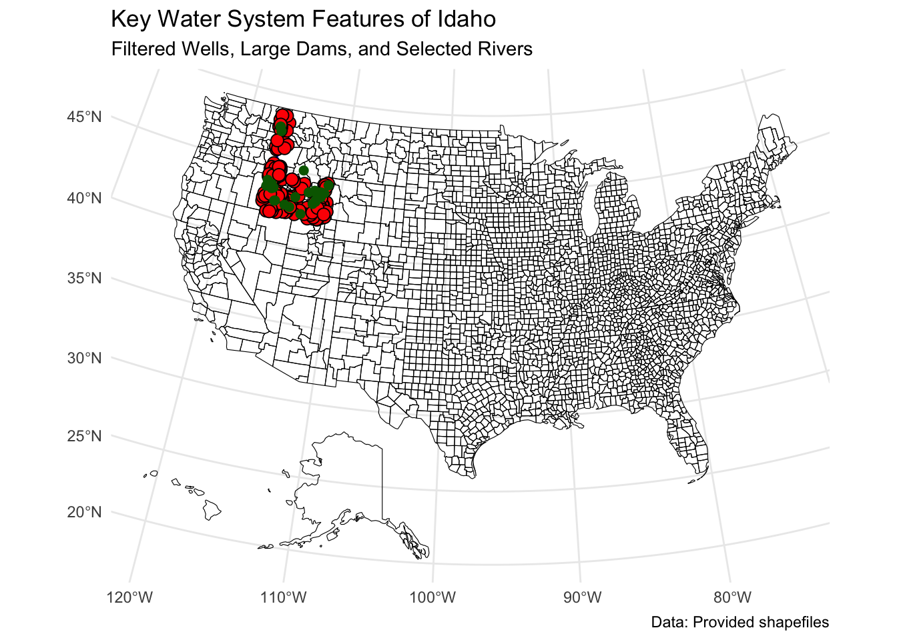

::: {.cell}

```{.r .cell-code}
library(sf)
library(tidyverse)
library(ggrepel)

# Idaho state shape
idaho <- st_read("Downloads/shp/County-AK-HI-Moved-USA-Map.shp")
```

::: {.cell-output .cell-output-stdout}

```
Reading layer `County-AK-HI-Moved-USA-Map' from data source 
  `/Users/Daniel/Downloads/shp/County-AK-HI-Moved-USA-Map.shp' 
  using driver `ESRI Shapefile'
Simple feature collection with 3115 features and 15 fields
Geometry type: MULTIPOLYGON
Dimension:     XY
Bounding box:  xmin: -2573301 ymin: -1889441 xmax: 2256474 ymax: 1565782
Projected CRS: Albers
```


:::

```{.r .cell-code}
# Water bodies
water <- st_read("Downloads/water/hyd250.shp")
```

::: {.cell-output .cell-output-stdout}

```
Reading layer `hyd250' from data source `/Users/Daniel/Downloads/water/hyd250.shp' using driver `ESRI Shapefile'
Simple feature collection with 30050 features and 26 fields
Geometry type: LINESTRING
Dimension:     XY
Bounding box:  xmin: 2241685 ymin: 1198722 xmax: 2743850 ymax: 1981814
Projected CRS: NAD83 / Idaho Transverse Mercator
```


:::

```{.r .cell-code}
# Wells
wells <- st_read("Downloads/Wells/Wells.shp")
```

::: {.cell-output .cell-output-stdout}

```
Reading layer `Wells' from data source `/Users/Daniel/Downloads/Wells/Wells.shp' using driver `ESRI Shapefile'
Simple feature collection with 195091 features and 33 fields
Geometry type: POINT
Dimension:     XY
Bounding box:  xmin: -117.3642 ymin: 41.02696 xmax: -111.0131 ymax: 49.00021
Geodetic CRS:  WGS 84
```


:::

```{.r .cell-code}
# Dams
dams <- st_read("Downloads/Idaho_Dams/Dam_Safety.shp")
```

::: {.cell-output .cell-output-stdout}

```
Reading layer `Dam_Safety' from data source 
  `/Users/Daniel/Downloads/Idaho_Dams/Dam_Safety.shp' using driver `ESRI Shapefile'
Simple feature collection with 1127 features and 23 fields
Geometry type: POINT
Dimension:     XY
Bounding box:  xmin: -117.0866 ymin: 42.00058 xmax: -111.0725 ymax: 48.95203
Geodetic CRS:  WGS 84
```


:::
:::


::: {.cell}

```{.r .cell-code}
# Wells producing more than 5000 gallons
wells_filtered <- wells %>% filter(Production > 5000)

# Dams with surface area > 50 acres
dams_filtered <- dams %>% filter(SurfaceAre > 50)

# Only Snake River and Henrys Fork
rivers_filtered <- water %>% filter(FEAT_NAME %in% c("Snake River", "Henrys Fork"))
```
:::


::: {.cell}

```{.r .cell-code}
target_crs <- 5070  # Albers Conical Equal Area for the US

idaho <- st_transform(idaho, crs = target_crs)
wells_filtered <- st_transform(wells_filtered, crs = target_crs)
dams_filtered <- st_transform(dams_filtered, crs = target_crs)
rivers_filtered <- st_transform(rivers_filtered, crs = target_crs)
```
:::


::: {.cell}

```{.r .cell-code}
idaho_map <- ggplot() +
  geom_sf(data = idaho, fill = NA, color = "black") +
  geom_sf(data = rivers_filtered, color = "blue", size = 1) +
  geom_sf(data = dams_filtered, fill = "red", shape = 21, size = 3) +
  geom_sf(data = wells_filtered, color = "darkgreen", size = 2) +
  theme_minimal() +
  labs(
    title = "Key Water System Features of Idaho",
    subtitle = "Filtered Wells, Large Dams, and Selected Rivers",
    caption = "Data: Provided shapefiles"
  )

idaho_map
```

::: {.cell-output-display}
{width=672}
:::

```{.r .cell-code}
ggsave("idaho_water_map.png", idaho_map, width = 15, height = 10, dpi = 300)
```
:::

