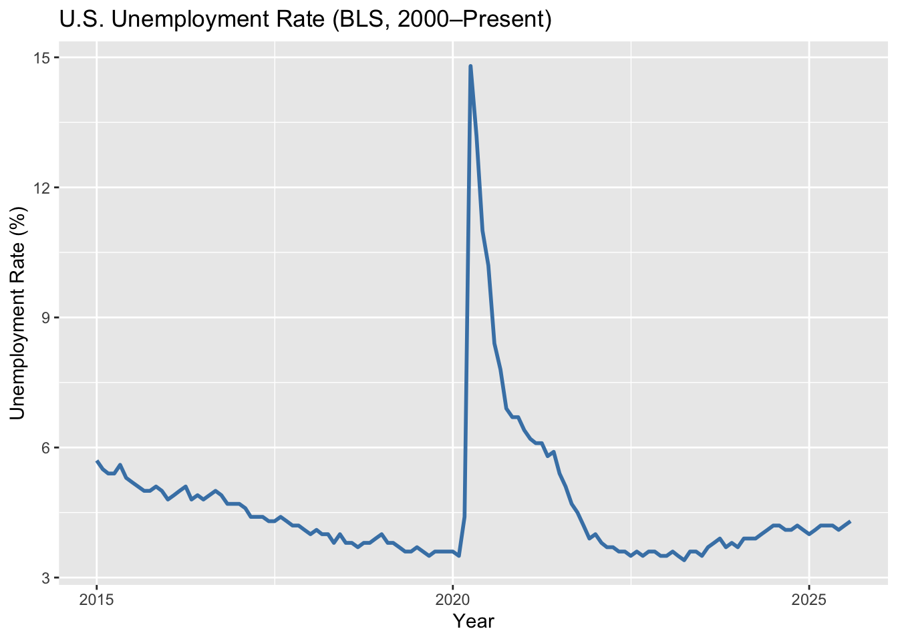
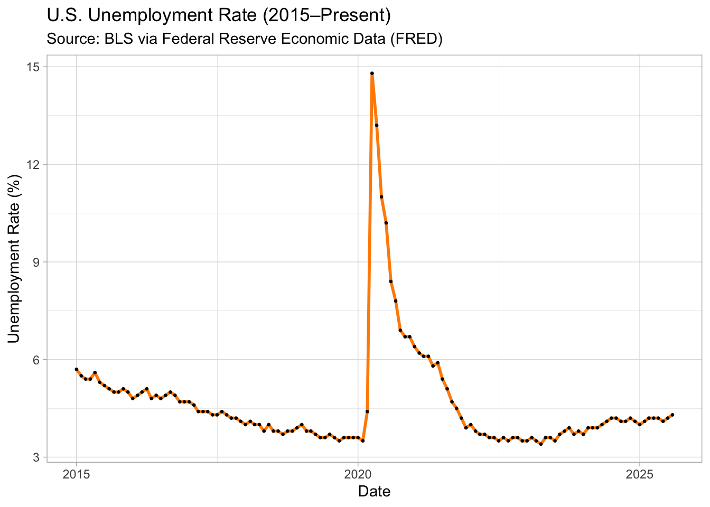
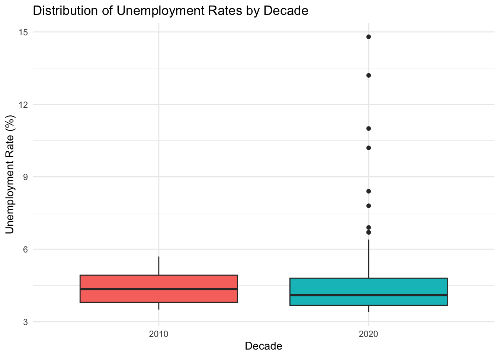

::: {.cell}

```{.r .cell-code}
library(tidyverse)
library(tidyquant)
library(lubridate)
```
:::


::: {.cell}

```{.r .cell-code}
# Unemployment rate (BLS source, through FRED API)

unemployment <- tq_get("UNRATE", get = "economic.data")

head(unemployment)
```

::: {.cell-output .cell-output-stdout}

```
# A tibble: 6 × 3
  symbol date       price
  <chr>  <date>     <dbl>
1 UNRATE 2015-01-01   5.7
2 UNRATE 2015-02-01   5.5
3 UNRATE 2015-03-01   5.4
4 UNRATE 2015-04-01   5.4
5 UNRATE 2015-05-01   5.6
6 UNRATE 2015-06-01   5.3
```


:::

```{.r .cell-code}
unemployment <- unemployment %>%
rename(unemployment_rate = price) %>%
mutate(year = year(date))
```
:::


::: {.cell}

```{.r .cell-code}
# Check for missing data

unemployment %>%
summarise(missing_values = sum(is.na(unemployment_rate)))
```

::: {.cell-output .cell-output-stdout}

```
# A tibble: 1 × 1
  missing_values
           <int>
1              0
```


:::
:::


::: {.cell}

```{.r .cell-code}
# Visualize unemployment over time

unemployment %>%
ggplot(aes(x = date, y = unemployment_rate)) +
geom_line(color = "steelblue", linewidth = 1) +
labs(title = "U.S. Unemployment Rate (BLS, 2000–Present)",
x = "Year", y = "Unemployment Rate (%)")
```

::: {.cell-output-display}
{width=672}
:::
:::


::: {.cell}

```{.r .cell-code}
unemployment %>%
filter(date >= as.Date("2015-01-01")) %>%
ggplot(aes(x = date, y = unemployment_rate)) +
geom_line(color = "darkorange", linewidth = 1) +
geom_point(size = 0.5) +
labs(
title = "U.S. Unemployment Rate (2015–Present)",
subtitle = "Source: BLS via Federal Reserve Economic Data (FRED)",
x = "Date",
y = "Unemployment Rate (%)"
) +
theme_light()
```

::: {.cell-output-display}
{width=672}
:::
:::


::: {.cell}

```{.r .cell-code}
# Create a decade variable
unemployment <- unemployment %>%
  mutate(decade = floor(year / 10) * 10)

# Boxplot by decade
unemployment %>%
  ggplot(aes(x = factor(decade), y = unemployment_rate, fill = factor(decade))) +
  geom_boxplot(show.legend = FALSE) +
  labs(
    title = "Distribution of Unemployment Rates by Decade",
    x = "Decade",
    y = "Unemployment Rate (%)"
  ) +
  theme_minimal()
```

::: {.cell-output-display}
{width=672}
:::
:::


We can see that during the COVID-19 pandemic that there was great volatility of unemployment with a spike that reached about 15%, but interestingly for the decade the overall mean, median, and upper and lower quartiles were lower than during the 2010s.
