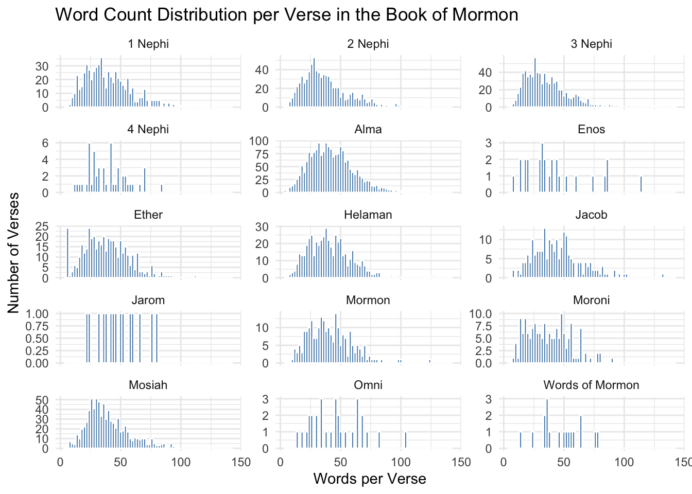

## 


::: {.cell}

```{.r .cell-code}
library(tidyverse)
library(stringr)

scriptures <- read_csv("~/Downloads/lds-scriptures.csv")

glimpse(scriptures)
```

::: {.cell-output .cell-output-stdout}

```
Rows: 41,995
Columns: 19
$ volume_id          <dbl> 1, 1, 1, 1, 1, 1, 1, 1, 1, 1, 1, 1, 1, 1, 1, 1, 1, …
$ book_id            <dbl> 1, 1, 1, 1, 1, 1, 1, 1, 1, 1, 1, 1, 1, 1, 1, 1, 1, …
$ chapter_id         <dbl> 1, 1, 1, 1, 1, 1, 1, 1, 1, 1, 1, 1, 1, 1, 1, 1, 1, …
$ verse_id           <dbl> 1, 2, 3, 4, 5, 6, 7, 8, 9, 10, 11, 12, 13, 14, 15, …
$ volume_title       <chr> "Old Testament", "Old Testament", "Old Testament", …
$ book_title         <chr> "Genesis", "Genesis", "Genesis", "Genesis", "Genesi…
$ volume_long_title  <chr> "The Old Testament", "The Old Testament", "The Old …
$ book_long_title    <chr> "The First Book of Moses called Genesis", "The Firs…
$ volume_subtitle    <chr> NA, NA, NA, NA, NA, NA, NA, NA, NA, NA, NA, NA, NA,…
$ book_subtitle      <chr> NA, NA, NA, NA, NA, NA, NA, NA, NA, NA, NA, NA, NA,…
$ volume_short_title <chr> "OT", "OT", "OT", "OT", "OT", "OT", "OT", "OT", "OT…
$ book_short_title   <chr> "Gen.", "Gen.", "Gen.", "Gen.", "Gen.", "Gen.", "Ge…
$ volume_lds_url     <chr> "ot", "ot", "ot", "ot", "ot", "ot", "ot", "ot", "ot…
$ book_lds_url       <chr> "gen", "gen", "gen", "gen", "gen", "gen", "gen", "g…
$ chapter_number     <dbl> 1, 1, 1, 1, 1, 1, 1, 1, 1, 1, 1, 1, 1, 1, 1, 1, 1, …
$ verse_number       <dbl> 1, 2, 3, 4, 5, 6, 7, 8, 9, 10, 11, 12, 13, 14, 15, …
$ scripture_text     <chr> "In the beginning God created the heaven and the ea…
$ verse_title        <chr> "Genesis 1:1", "Genesis 1:2", "Genesis 1:3", "Genes…
$ verse_short_title  <chr> "Gen. 1:1", "Gen. 1:2", "Gen. 1:3", "Gen. 1:4", "Ge…
```


:::
:::


::: {.cell}

```{.r .cell-code}
df <- scriptures %>%
  mutate(
    word_count = str_count(scripture_text, boundary("word")),
    contains_jesus = str_detect(tolower(scripture_text), "\\bjesus\\b")
  )
```
:::


::: {.cell}

```{.r .cell-code}
avg_lengths <- df %>%
filter(volume_title %in% c("New Testament", "Book of Mormon")) %>%
group_by(volume_title) %>%
summarise(
avg_words = mean(word_count, na.rm = TRUE),
verse_count = n()
)

avg_lengths
```

::: {.cell-output .cell-output-stdout}

```
# A tibble: 2 × 3
  volume_title   avg_words verse_count
  <chr>              <dbl>       <int>
1 Book of Mormon      40.5        6604
2 New Testament       22.7        7957
```


:::
:::


The average words in the Book of Mormon is more than the New Testament by almost double, and the New Testament has longer verses.

# Counting times "Jesus" is mentioned


::: {.cell}

```{.r .cell-code}
jesus_counts <- df %>%
filter(volume_title %in% c("New Testament", "Book of Mormon")) %>%
group_by(volume_title) %>%
summarise(
jesus_mentions = sum(contains_jesus)
)

jesus_counts
```

::: {.cell-output .cell-output-stdout}

```
# A tibble: 2 × 2
  volume_title   jesus_mentions
  <chr>                   <int>
1 Book of Mormon            161
2 New Testament             943
```


:::
:::


When strictly finding the word "Jesus" we see that it appears much more in the New Testament than in the Book of Mormon, however this is not accounting for other names/nicknames that Jesus has like Savior, Lord, Christ, etc...

# Drilling only into the Book of Mormon


::: {.cell}

```{.r .cell-code}
bom_df <- df %>%
filter(volume_title == "Book of Mormon")

ggplot(bom_df, aes(x = word_count)) +
geom_histogram(binwidth = 2, fill="steelblue", color="white") +
facet_wrap(~ book_title, scales="free_y", ncol=3) +
labs(
title = "Word Count Distribution per Verse in the Book of Mormon",
x = "Words per Verse",
y = "Number of Verses"
) +
theme_minimal()
```

::: {.cell-output-display}
{width=672}
:::
:::

