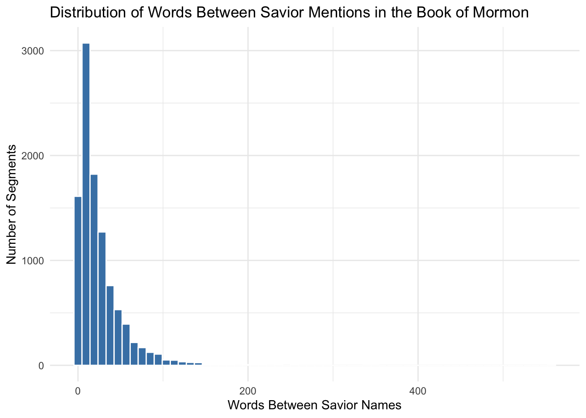

## Load


::: {.cell}

```{.r .cell-code}
library(tidyverse)
library(stringr)

# Load scripture dataset
scriptures <- read_csv("~/Downloads/lds-scriptures.csv")

# Load Savior names dataset
savior_names <- read_rds("https://byuistats.github.io/M335/data/BoM_SaviorNames.rds")

glimpse(scriptures)
```

::: {.cell-output .cell-output-stdout}

```
Rows: 41,995
Columns: 19
$ volume_id          <dbl> 1, 1, 1, 1, 1, 1, 1, 1, 1, 1, 1, 1, 1, 1, 1, 1, 1, …
$ book_id            <dbl> 1, 1, 1, 1, 1, 1, 1, 1, 1, 1, 1, 1, 1, 1, 1, 1, 1, …
$ chapter_id         <dbl> 1, 1, 1, 1, 1, 1, 1, 1, 1, 1, 1, 1, 1, 1, 1, 1, 1, …
$ verse_id           <dbl> 1, 2, 3, 4, 5, 6, 7, 8, 9, 10, 11, 12, 13, 14, 15, …
$ volume_title       <chr> "Old Testament", "Old Testament", "Old Testament", …
$ book_title         <chr> "Genesis", "Genesis", "Genesis", "Genesis", "Genesi…
$ volume_long_title  <chr> "The Old Testament", "The Old Testament", "The Old …
$ book_long_title    <chr> "The First Book of Moses called Genesis", "The Firs…
$ volume_subtitle    <chr> NA, NA, NA, NA, NA, NA, NA, NA, NA, NA, NA, NA, NA,…
$ book_subtitle      <chr> NA, NA, NA, NA, NA, NA, NA, NA, NA, NA, NA, NA, NA,…
$ volume_short_title <chr> "OT", "OT", "OT", "OT", "OT", "OT", "OT", "OT", "OT…
$ book_short_title   <chr> "Gen.", "Gen.", "Gen.", "Gen.", "Gen.", "Gen.", "Ge…
$ volume_lds_url     <chr> "ot", "ot", "ot", "ot", "ot", "ot", "ot", "ot", "ot…
$ book_lds_url       <chr> "gen", "gen", "gen", "gen", "gen", "gen", "gen", "g…
$ chapter_number     <dbl> 1, 1, 1, 1, 1, 1, 1, 1, 1, 1, 1, 1, 1, 1, 1, 1, 1, …
$ verse_number       <dbl> 1, 2, 3, 4, 5, 6, 7, 8, 9, 10, 11, 12, 13, 14, 15, …
$ scripture_text     <chr> "In the beginning God created the heaven and the ea…
$ verse_title        <chr> "Genesis 1:1", "Genesis 1:2", "Genesis 1:3", "Genes…
$ verse_short_title  <chr> "Gen. 1:1", "Gen. 1:2", "Gen. 1:3", "Gen. 1:4", "Ge…
```


:::

```{.r .cell-code}
glimpse(savior_names)
```

::: {.cell-output .cell-output-stdout}

```
Rows: 112
Columns: 6
$ Book          <chr> "Ether", "Mosiah", "Mormon", "3 Nephi", "Mosiah", "Mosia…
$ chapter_verse <chr> "4:7", "3:8", "9:29", "10:10", "7:19", "15:4", "7:27", "…
$ name          <chr> "the Father of the heavens and of the earth, and all thi…
$ reference     <chr> "Ether 4:7", "Mosiah 3:8", "Mormon 9:29", "3 Nephi 10:10…
$ nchar         <int> 75, 40, 39, 37, 36, 34, 29, 29, 28, 28, 28, 27, 27, 26, …
$ words         <int> 16, 7, 8, 6, 7, 6, 6, 6, 6, 6, 5, 4, 5, 5, 5, 4, 5, 5, 5…
```


:::
:::


::: {.cell}

```{.r .cell-code}
# Filter for Book of Mormon

bom <- scriptures %>%
filter(volume_title == "Book of Mormon")

# Collapse all verses into a single string

full_bom_text <- bom$scripture_text %>% paste(collapse = " ")
```
:::


::: {.cell}

```{.r .cell-code}
savior_pattern <- savior_names$name %>%
  str_replace_all("([\\^$.|?*+()\\[\\]])", "\\\\\\1") %>%
  paste(collapse = "|")
```
:::


::: {.cell}

```{.r .cell-code}
# Split the text on every Savior name

segments <- str_split(full_bom_text, regex(savior_pattern, ignore_case = TRUE))[[1]]

# Count words in each segment

words_between <- str_count(segments, boundary("word"))

# Remove the first segment (text before first Savior mention)

words_between <- words_between[-1]

# Put into a tibble for plotting

dist_df <- tibble(words_between = words_between)
```
:::


::: {.cell}

```{.r .cell-code}
ggplot(dist_df, aes(x = words_between)) +
geom_histogram(bins = 60, fill = "steelblue", color = "white") +
labs(
title = "Distribution of Words Between Savior Mentions in the Book of Mormon",
x = "Words Between Savior Names",
y = "Number of Segments"
) +
theme_minimal()
```

::: {.cell-output-display}
{width=672}
:::
:::


::: {.cell}

```{.r .cell-code}
mean(dist_df$words_between)
```

::: {.cell-output .cell-output-stdout}

```
[1] 25.29357
```


:::
:::


The plot tells me that the distribution is heavily right skewed and that the majority of distance of words between the saviors name is between 20 and 30 and many being basically back to back or within 10 words. This tells me that there might be some chapters in the Book of Mormon that mention the Lords name many times, with sometimes multiple times in a single verse, and maybe some chapters in the book the (like the war chapters) that might not mention His name as much and be the reason for the skewness in the distribution chart.
