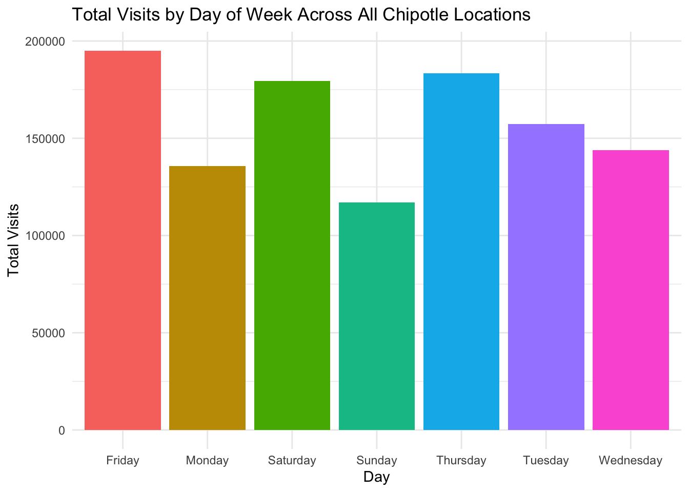
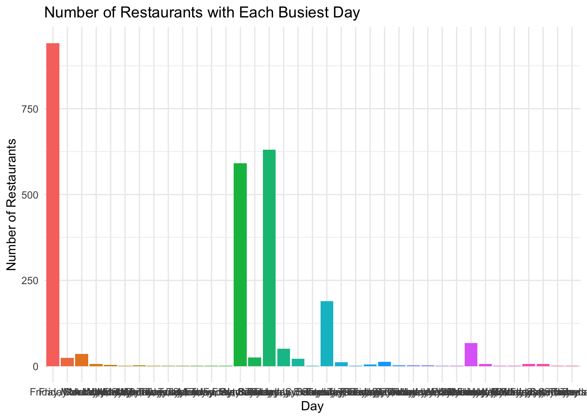

::: {.cell}

```{.r .cell-code}
# Load libraries

library(tidyverse)
library(stringr)
library(purrr)

pop_string_to_tibble <- function(pop_string) {
  clean <- pop_string |>
    str_replace_all('“', '"') |>
    str_replace_all('”', '"') |>
    str_remove_all("[{}]")

  df <- str_match_all(clean, '"(\\w+)":(\\d+)')[[1]] |>
    as_tibble() |>
    select(day = V2, visits = V3) |>
    mutate(visits = as.numeric(visits))
  
  return(df)
}
```
:::


::: {.cell}

```{.r .cell-code}
pop_string_to_tibble <- function(pop_string) {

  # Handle missing strings
  if (is.na(pop_string) | pop_string == "NA") {
    return(tibble(day = NA, visits = NA))
  }

  clean <- pop_string |>
    str_replace_all('“', '"') |>
    str_replace_all('”', '"') |>
    str_remove_all("[{}]")

  df <- str_match_all(clean, '"(\\w+)":(\\d+)')[[1]] |>
    as_tibble() |>
    select(day = V2, visits = V3) |>
    mutate(visits = as.numeric(visits))

  return(df)
}
```
:::


::: {.cell}

```{.r .cell-code}
most_popular_day <- function(pop_string) {

  df <- pop_string_to_tibble(pop_string)

  # If all NA, return NA
  if (all(is.na(df$visits))) {
    return(NA_character_)
  }

  max_visits <- max(df$visits)

  top_days <- df |>
    filter(visits == max_visits) |>
    pull(day)

  paste(top_days, collapse = ", ")
}
```
:::


::: {.cell}

```{.r .cell-code}
chipotle <- read_csv(
  "https://byuistats.github.io/M335/data/chipotle_reduced.csv"
)
```
:::


::: {.cell}

```{.r .cell-code}
test2 <- "{“Monday”:18,“Tuesday”:16,“Wednesday”:14,“Thursday”:27,“Friday”:26,“Saturday”:36,“Sunday”:20}"

pop_string_to_tibble(test2)
```

::: {.cell-output .cell-output-stdout}

```
# A tibble: 7 × 2
  day       visits
  <chr>      <dbl>
1 Monday        18
2 Tuesday       16
3 Wednesday     14
4 Thursday      27
5 Friday        26
6 Saturday      36
7 Sunday        20
```


:::

```{.r .cell-code}
most_popular_day(test2)
```

::: {.cell-output .cell-output-stdout}

```
[1] "Saturday"
```


:::
:::


::: {.cell}

```{.r .cell-code}
test2 <- '{"Monday":18,"Tuesday":16,"Wednesday":14,"Thursday":27,"Friday":26,"Saturday":36,"Sunday":20}'
pop_string_to_tibble(test2)
```

::: {.cell-output .cell-output-stdout}

```
# A tibble: 7 × 2
  day       visits
  <chr>      <dbl>
1 Monday        18
2 Tuesday       16
3 Wednesday     14
4 Thursday      27
5 Friday        26
6 Saturday      36
7 Sunday        20
```


:::

```{.r .cell-code}
most_popular_day(test2)
```

::: {.cell-output .cell-output-stdout}

```
[1] "Saturday"
```


:::
:::


::: {.cell}

```{.r .cell-code}
test3 <- '{"Monday":0,"Tuesday":0,"Wednesday":1,"Thursday":0,"Friday":0,"Saturday":1,"Sunday":0}'
pop_string_to_tibble(test3)
```

::: {.cell-output .cell-output-stdout}

```
# A tibble: 7 × 2
  day       visits
  <chr>      <dbl>
1 Monday         0
2 Tuesday        0
3 Wednesday      1
4 Thursday       0
5 Friday         0
6 Saturday       1
7 Sunday         0
```


:::

```{.r .cell-code}
most_popular_day(test3)
```

::: {.cell-output .cell-output-stdout}

```
[1] "Wednesday, Saturday"
```


:::
:::


::: {.cell}

```{.r .cell-code}
chipotle_nested <- chipotle %>%
mutate(weekly_visits = map(popularity_by_day, pop_string_to_tibble))
```
:::


::: {.cell}

```{.r .cell-code}
# Unnest and summarize visits

visits_long <- chipotle_nested %>%
unnest(weekly_visits) %>%
filter(!is.na(day), !is.na(visits))

visits_summary <- visits_long %>%
group_by(day) %>%
summarize(total_visits = sum(visits), .groups = "drop")

# Plot

ggplot(visits_summary, aes(x = day, y = total_visits, fill = day)) +
geom_col() +
theme_minimal() +
labs(
title = "Total Visits by Day of Week Across All Chipotle Locations",
x = "Day",
y = "Total Visits"
) +
theme(legend.position = "none")
```

::: {.cell-output-display}
{width=672}
:::
:::


# Explanation


::: {.cell}

```{.r .cell-code}
chipotle_nested <- chipotle_nested %>%
mutate(busiest_day = map_chr(popularity_by_day, most_popular_day))
```
:::


::: {.cell}

```{.r .cell-code}
busiest_summary <- chipotle_nested %>%
filter(!is.na(busiest_day)) %>%
count(busiest_day)

ggplot(busiest_summary, aes(x = busiest_day, y = n, fill = busiest_day)) +
geom_col() +
theme_minimal() +
labs(
title = "Number of Restaurants with Each Busiest Day",
x = "Day",
y = "Number of Restaurants"
) +
theme(legend.position = "none")
```

::: {.cell-output-display}
{width=672}
:::
:::


# Summary

Across all locations, both charts show that **Friday, Saturday and surprisingly Thursday** are consistently the highest-traffic days for Chipotle. The first visualization (total visits across all stores) reveals that these days draw the most customers system-wide. The second visualization shows that many individual restaurants also peak on Friday or Saturday, reinforcing their importance.

Due to those two days the goal of the promotion would be to reach the highest number of customers, if we follow the goals then instead we would boost slow days, like Monday or tuesday would be the idea target days.

Between the two the visual total visits chart was the most helpful to measure actual customer volume.


::: {.cell}

```{.r .cell-code}
saveRDS(chipotle_nested, "chipotle_nested.rds")
```
:::

