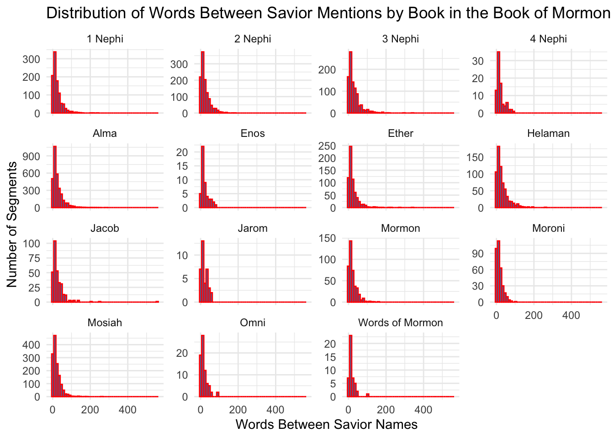
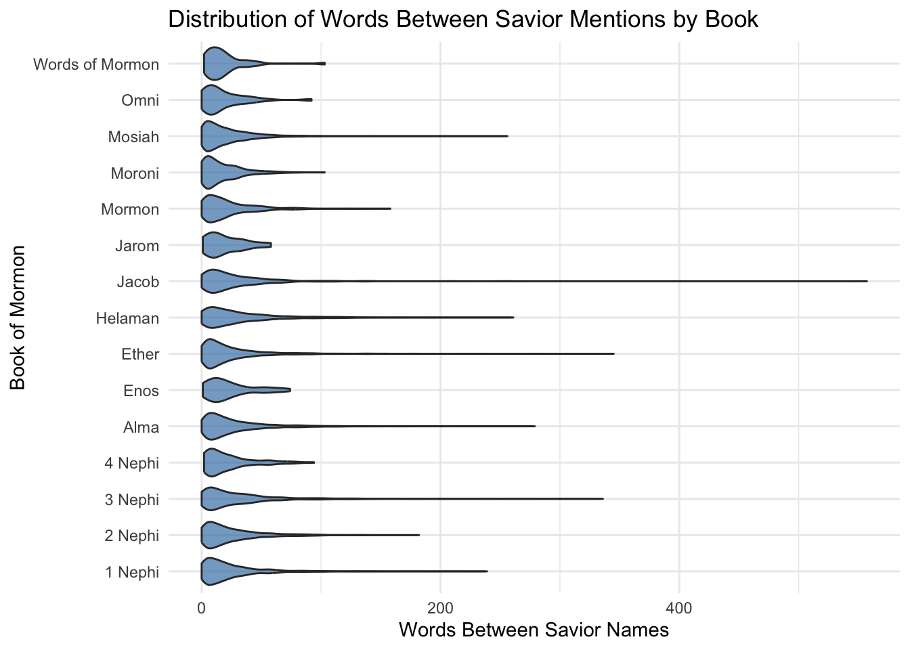

## Load


::: {.cell}

```{.r .cell-code}
library(tidyverse)
library(stringr)
library(purrr)

# Load scripture dataset
scriptures <- read_csv("~/Downloads/lds-scriptures.csv")

# Load Savior names dataset
savior_names <- read_rds("https://byuistats.github.io/M335/data/BoM_SaviorNames.rds")

# Filter for Book of Mormon
bom <- scriptures %>%
  filter(volume_title == "Book of Mormon")
```
:::


::: {.cell}

```{.r .cell-code}
savior_pattern <- savior_names$name %>%
  str_replace_all("([\\^$.|?*+()\\[\\]])", "\\\\\\1") %>%
  paste(collapse = "|")
```
:::


::: {.cell}

```{.r .cell-code}
bom_nested <- bom %>%
  group_by(book_title) %>%
  summarize(full_text = paste(scripture_text, collapse = " ")) %>%
  ungroup() %>%
  nest(data = full_text)
```
:::


::: {.cell}

```{.r .cell-code}
bom_nested <- bom_nested %>%
  mutate(
    words_between = map(data, ~{
      text <- .x$full_text
      segments <- str_split(text, regex(savior_pattern, ignore_case = TRUE))[[1]]
      words <- str_count(segments, boundary("word"))
      words <- words[-1]  # Remove first segment (before first mention)
      tibble(words_between = words)
    })
  ) %>%
  select(-data) %>%
  unnest(words_between)
```
:::


::: {.cell}

```{.r .cell-code}
ggplot(bom_nested, aes(x = words_between)) +
  geom_histogram(bins = 50, fill = "steelblue", color = "red") +
  facet_wrap(~ book_title, scales = "free_y") +
  labs(
    title = "Distribution of Words Between Savior Mentions by Book in the Book of Mormon",
    x = "Words Between Savior Names",
    y = "Number of Segments"
  ) +
  theme_minimal()
```

::: {.cell-output-display}
{width=672}
:::
:::


::: {.cell}

```{.r .cell-code}
ggplot(bom_nested, aes(x = book_title, y = words_between)) +
  geom_violin(fill = "steelblue", alpha = 0.7) +
  coord_flip() +
  labs(
    title = "Distribution of Words Between Savior Mentions by Book",
    x = "Book of Mormon",
    y = "Words Between Savior Names"
  ) +
  theme_minimal()
```

::: {.cell-output-display}
{width=672}
:::
:::


# Summary

For the different books of Mormon it gives me an insight on which books have sections where the Savior isn't mentioned and that they are mostly Jacob, Ether, and surprisingly 3 Nephi. However, the loner the book the higher likelihood of a further distance between Savior names, for example Enos, Omni, and Words of Mormon are all very short books and therefore cannot have distances that are too far from each other.
